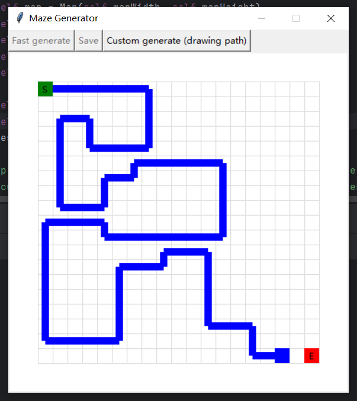

# Maze Generator

    绘制一个图案路径，然后根据该路径生成一个迷宫。您可以使用自己设计的文子图形、图案等作为迷宫的路径。
    此路径是唯一路径。
    Draw a pattern path and then generate a maze based on that path.
    You can draw the text, patterns, etc. of your own design as the path of the maze.
    This path is the only path that leads to the end point.

# 使用

    运行`ui.py`进入界面即可。

    其他三个文件包含了相关的类。
    需要安装PIL库用于将生成结果导出为jpg文件。

    地图的长、宽、缩放等都是可以调的，只是还未制作一个可视化界面。

##### 关于自定义生成的说明：

    1. 点击 `Custom generate` 按钮

    2. 使用 ↑、↓、←、→ 四个按键移动光标，绘制出想要的图案。
    再次点击 `Custom generate` 按钮重新绘制。

    3. 将光标移到终点（E），自动生成迷宫。
    所绘制的路径是迷宫的唯一答案。

# 版本
###### v1.0.0: 

    1.实现基本的生成迷宫功能
    2.做了一个简单的ui
    3.实现了导出为jpg文件的功能